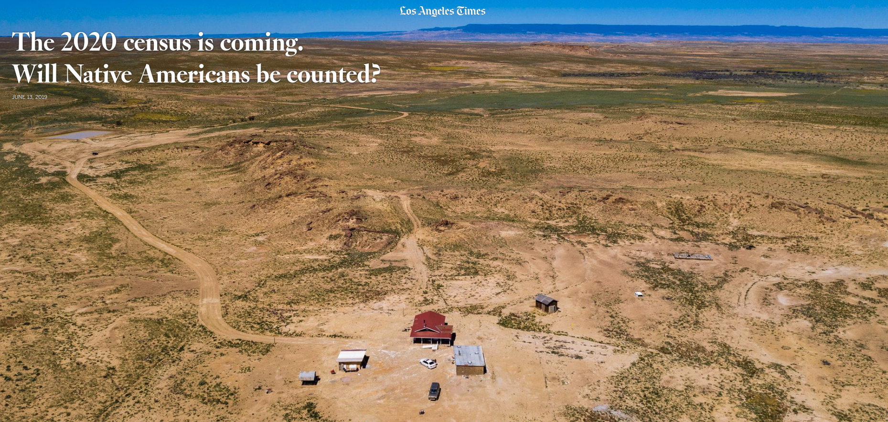

# census-data-downloader

Download [American Community Survey data](https://www.census.gov/programs-surveys/acs/data.html) from the U.S. Census Bureau and reformat it for humans.

## What's available

All of the data files processed by this repository are published in the [`data/processed/`](./data/processed/) folder. They can be called in to applications via their raw URLs, like https://raw.githubusercontent.com/datadesk/census-data-downloader/master/data/processed/acs5_2017_population_counties.csv

## The command-line interface

The library can be installed as a command-line interface that lets you download files on demand.

### Installation

```bash
$ pipenv install census-data-downloader
```

### Command-line usage

There's now a tool named `censusdatadownloader` ready for you.

```bash
Usage: censusdatadownloader [OPTIONS] TABLE COMMAND [ARGS]...

  Download Census data and reformat it for humans

Options:
  --data-dir TEXT  The folder where you want to download the data
  --year [2009-2019]   The years of data to download. By default it gets only the
                   latest year. Not all data are available for every year. Submit 'all' to get every year.
  --force          Force the downloading of the data
  --help           Show this message and exit.

Commands:
  aiannhhomelands            Download American Indian, Alaska Native and...
  cnectas                    Download combined New England city and town...
  congressionaldistricts     Download Congressional districts
  counties                   Download counties in all states
  csas                       Download combined statistical areas
  divisions                  Download divisions
  elementaryschooldistricts  Download elementary school districts
  everything                 Download everything from everywhere
  msas                       Download metropolitian statistical areas
  nationwide                 Download nationwide data
  nectas                     Download New England city and town areas
  places                     Download Census-designated places
  pumas                      Download public use microdata areas
  regions                    Download regions
  secondaryschooldistricts   Download secondary school districts
  statelegislativedistricts  Download statehouse districts
  states                     Download states
  tracts                     Download Census tracts
  unifiedschooldistricts     Download unified school districts
  urbanareas                 Download urban areas
  zctas                      Download ZIP Code tabulation areas
```

Before you can use it you will need to add your CENSUS_API_KEY to your environment. If you don't have an API key, you can go [here.](https://api.census.gov/data/key_signup.html) One quick way to add your key:

```bash
$ export CENSUS_API_KEY='<your API key>'
```

Using it is as simple as providing one our processed table names to one of the download subcommands.

Here's an example of downloading all state-level data from the `medianage` dataset.

```bash
$ censusdatadownloader medianage states
```

You can specify the download directory with `--data-dir`.

```bash
$ censusdatadownloader --data-dir ./my-special-folder/ medianage states
```

And you can change the year you download with `--year`.

```bash
$ censusdatadownloader --year 2010 medianage states
```

That's it. Mix and match tables and subcommands to get whatever you need.

### Python usage

You can also download tables from Python scripts. Import the class of the [processed table](https://github.com/datadesk/census-data-downloader/tree/master/census_data_downloader/tables) you wish to retrieve and pass in your API key. Then call one of the download methods.

This example brings in all state-level data from the medianhouseholdincomeblack dataset.

```python
>>> from census_data_downloader.tables import MedianHouseholdIncomeBlackDownloader
>>> downloader = MedianHouseholdIncomeBlackDownloader('<YOUR KEY>')
>>> downloader.download_states()
```

You can specify the data directory and the years by passing in the `data_dir` and `years` keyword arguments.

```python
>>> downloader = MedianHouseholdIncomeBlackDownloader('<YOUR KEY>', data_dir='./', years=2016)
>>> downloader.download_states()
```

### Usage examples

A gallery of graphics powered by our data is available on [Observable](https://observablehq.com/collection/@datadesk/u-s-census-data).

[](https://observablehq.com/collection/@datadesk/u-s-census-data)

The Los Angeles Times used this library for [an analysis of Census undercounts](https://www.latimes.com/projects/la-na-census-native-americans-navajo-nation/) on Native American reservations. The code that powers it is available as an [open-source computational notebook](https://github.com/datadesk/native-american-census-analysis).

[](https://www.latimes.com/projects/la-na-census-native-americans-navajo-nation/)

## Contributing to the library

### Adding support for a new table

Subclass our downloader and provided it with its required inputs.

```python
import collections
from census_data_downloader.core.tables import BaseTableConfig
from census_data_downloader.core.decorators import register


@register
class MedianHouseholdIncomeDownloader(BaseTableConfig):
    PROCESSED_TABLE_NAME = "medianhouseholdincome"  # Your humanized table name
    UNIVERSE = "households"  # The universe value for this table
    RAW_TABLE_NAME = 'B19013'  # The id of the source table
    RAW_FIELD_CROSSWALK = collections.OrderedDict({
        # A crosswalk between the raw field name and our humanized field name.
        "001": "median"
    })
```

Add it to the imports in the [`__init__.py`](census_data_downloader/tables/__init__.py) file and it's good to go.

### Developing the CLI

The command-line interface is implemented using Click and setuptools. To install it locally for development inside your virtual environment, run the following installation command, as [prescribed by the Click documentation](https://click.palletsprojects.com/en/7.x/setuptools/#setuptools-integration).

```bash
$ pip install --editable .
```

That's it. If you make some good ones, please consider submitting them as pull requests so everyone can benefit.
