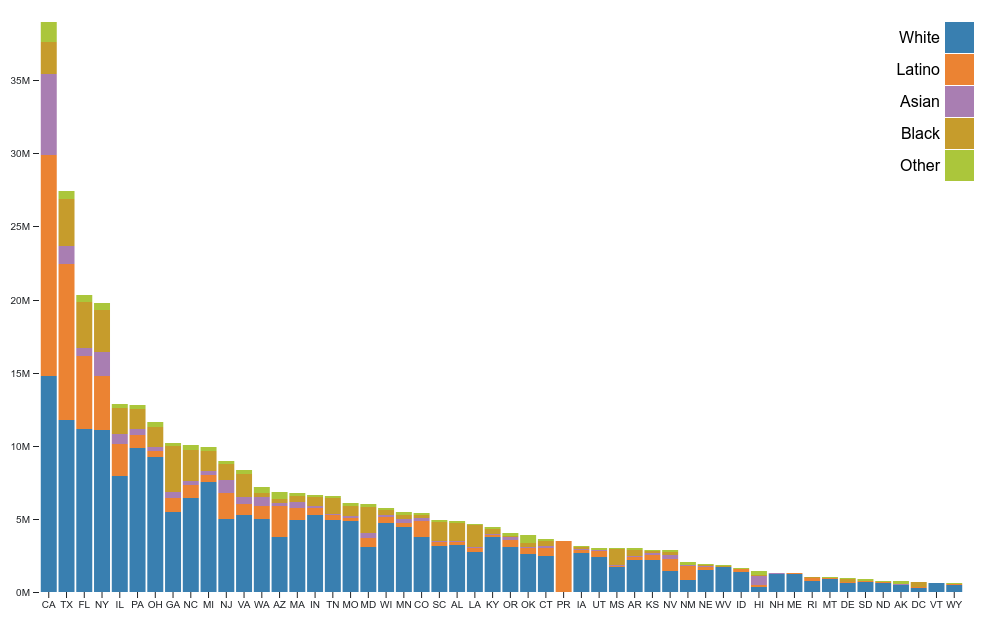
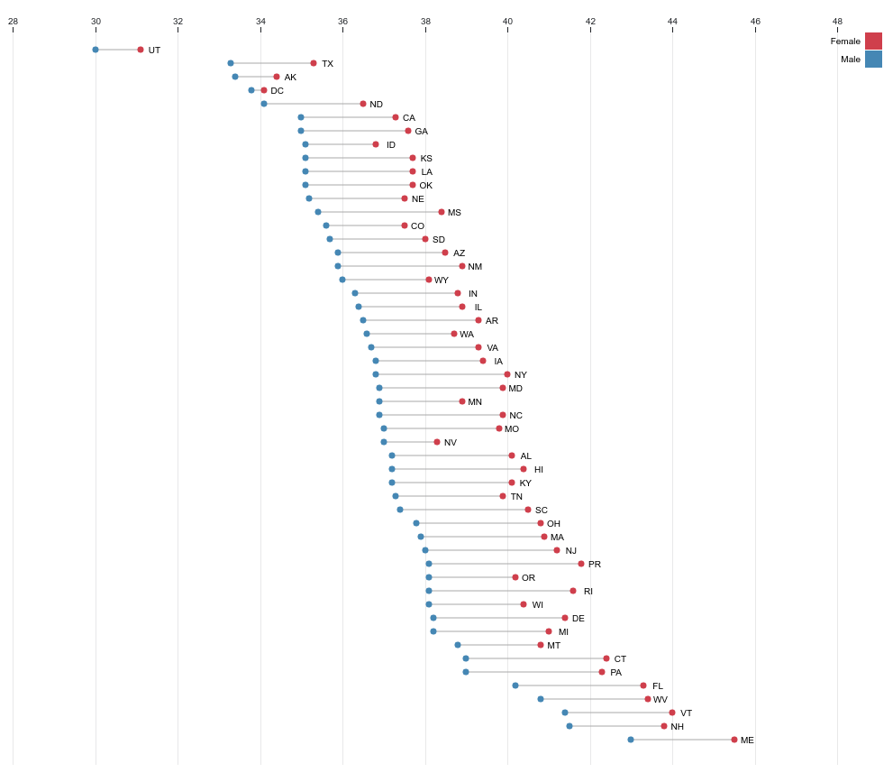
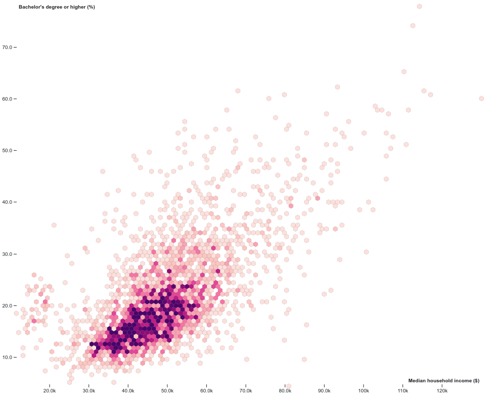
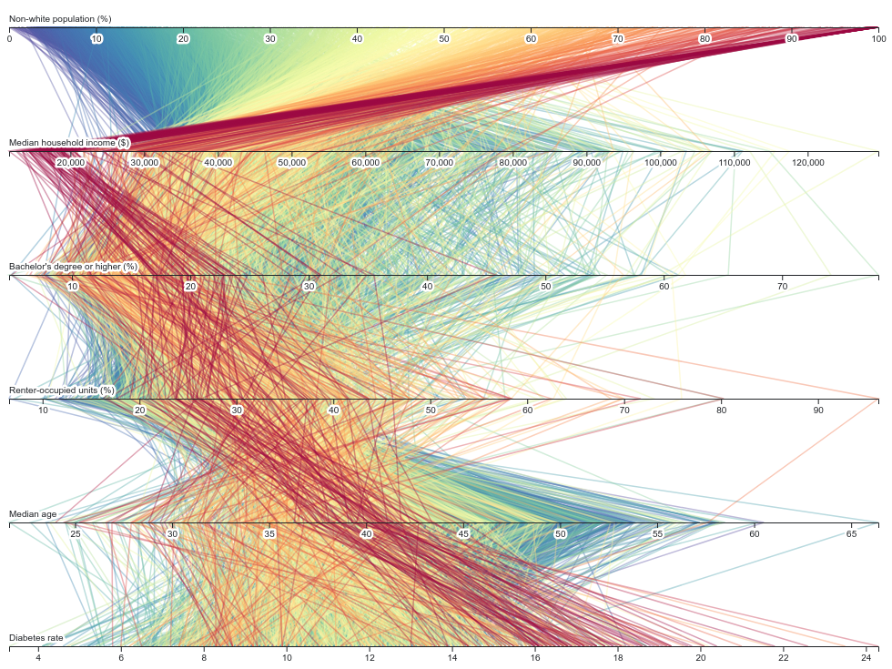

# census-data-downloader

Download Census data and reformat it for humans.

### Installation

```bash
$ pipenv install census-data-downloader
```

### Usage

There's now a command-line tool named `censusdatadownloader` ready for you.

```base
Usage: censusdatadownloader [OPTIONS] TABLE COMMAND [ARGS]...

  Download Census data and reformat it for humans

Options:
  --data-dir TEXT  The folder where you want to download the data
  --year INTEGER   The years of data to download. By default it gets only the
                   latest year. Submit 'all' to get every year.
  --force          Force the downloading of the data
  --help           Show this message and exit.

Commands:
  congressionaldistricts     Download Congressional districts
  counties                   Download counties in all states
  everything                 Download everything from everywhere
  nationwide                 Download nationwide data
  places                     Download Census-designated places
  statelegislativedistricts  Download statehouse districts in provided state
  states                     Download states
  tracts                     Download Census tracts in provided state
  usa                        Download all datasets that cover full USA
```

Before you can use it you will need to add your CENSUS_API_KEY to your environment. Here's one quick way to do that:

```bash
$ export CENSUS_API_KEY='<your API key>'
```

Using it is as simple as providing one our processed table names to one of the download subcommands.

Here's an example of downloading all state-level data from the `medianage` dataset.

```bash
$ censusdatadownloader medianage states
```

You can specify the download directory with `--data-dir`.

```bash
$ censusdatadownloader --data-dir ./my-special-folder/ medianage states
```

And you can change the year you download with `--year`.

```bash
$ censusdatadownloader --year 2010 medianage states
```

That's it. Mix and match tables and subcommands to get whatever you need.

### Adding support for a new table

Subclass our downloader and provided it with its required inputs.

```python
import collections
from .base import BaseDownloader
from .registry import register_downloader


@register_downloader
class MedianHouseholdIncomeDownloader(BaseDownloader):
    PROCESSED_TABLE_NAME = "medianhouseholdincome"  # Your humanized table name
    RAW_TABLE_NAME = 'B19013'  # The id of the source table
    RAW_FIELD_CROSSWALK = collections.OrderedDict({
        # A crosswalk between the raw field name and our humanized field name.
        "001E": "median"
    })
```

Now you can import and run it yourself.

```python
>>> from yourmodule import MedianHouseholdIncomeDownloader
>>> obj = MedianHouseholdIncomeDownloader("<YOUR CENSUS API KEY>", data_dir="./your-data-folder/")
>>> obj.download_everything()
```

That's it. If you make some good ones, please consider submitting them as pull requests so everyone can benefit.

### Working with the data

All of the data files processed by this repository are published in the [processed data](./data/processed/) folder. They can be called in to applications via their raw URLs. Here are some examples created using [Observable](https://observablehq.com/collection/@datadesk/u-s-census-data).

Here's [county-level race data](https://github.com/datadesk/census-data-downloader/blob/master/data/processed/acs5_2017_race_counties.csv) in [a bivariate map](https://observablehq.com/@datadesk/black-and-latino-u-s-population-shares) of black and Latino populations.

[](https://observablehq.com/@datadesk/black-and-latino-u-s-population-shares)

Now [a stacked bar](https://observablehq.com/@datadesk/racial-makeup-of-u-s-states-and-territories) using the [state-level version](https://github.com/datadesk/census-data-downloader/blob/master/data/processed/acs5_2017_race_states.csv) of the race dataset.

[](https://observablehq.com/@datadesk/racial-makeup-of-u-s-states-and-territories)

Median age by state can take a totally different form.

[](https://observablehq.com/@datadesk/median-age-by-sex-in-u-s-states-and-territories)

Datasets can be easily combined using the Census Bureau's `geoid` field. Here's [education and income by county](https://observablehq.com/@datadesk/education-and-income-in-u-s-counties) in a scatterplot with hexagonal bins.

[](https://observablehq.com/@datadesk/education-and-income-in-u-s-counties)

Lace a few more county-level datasets in and you can make [parallel coordinates charts](https://observablehq.com/@datadesk/the-demographics-and-destiny-of-all-3-220-u-s-counties).

[](https://observablehq.com/@datadesk/the-demographics-and-destiny-of-all-3-220-u-s-counties)
